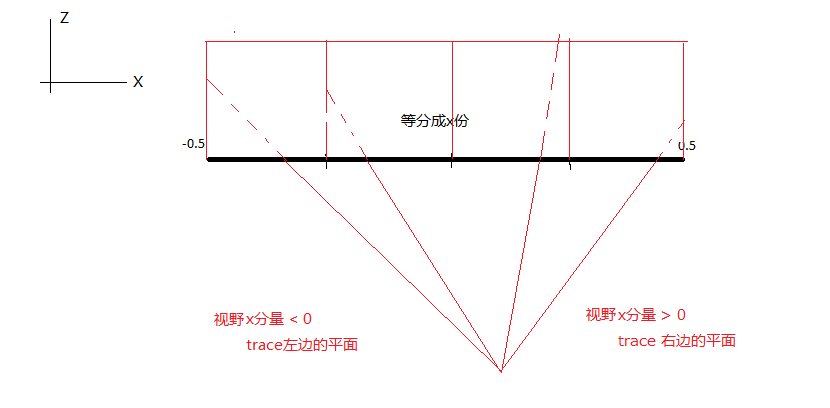
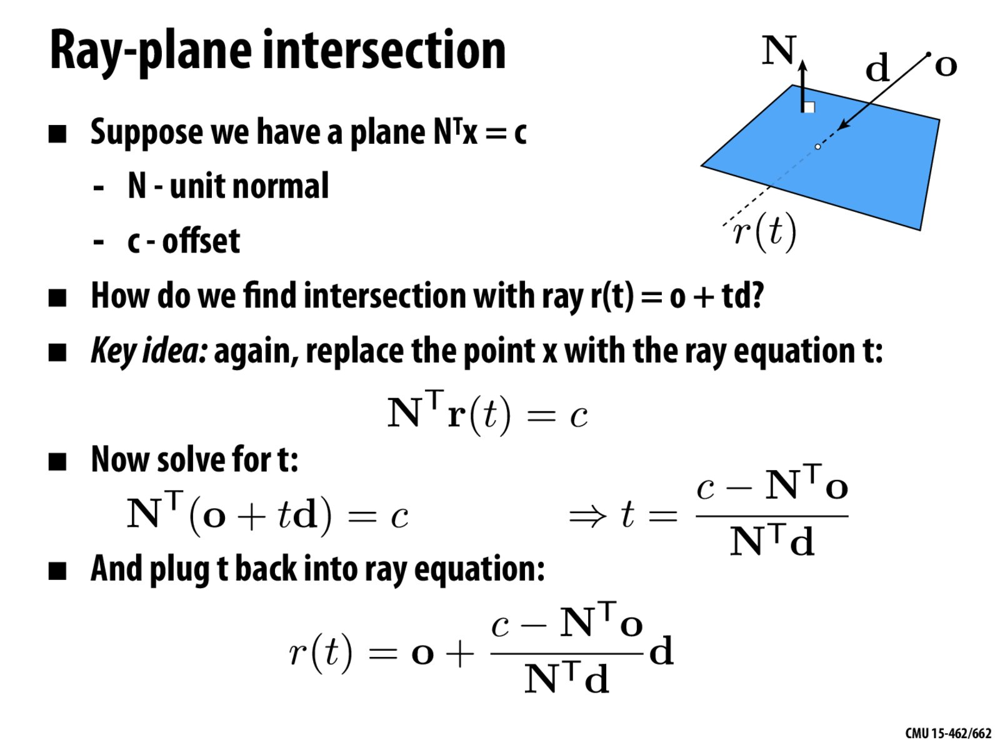
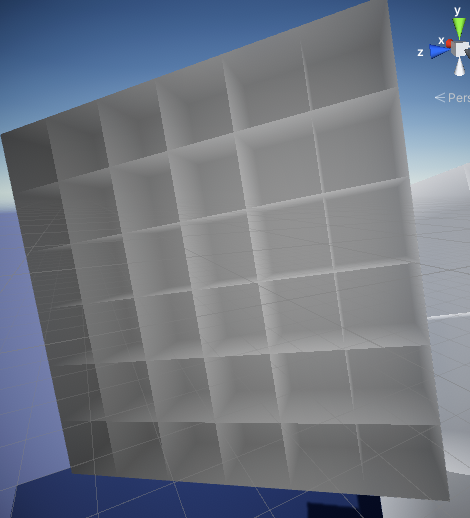
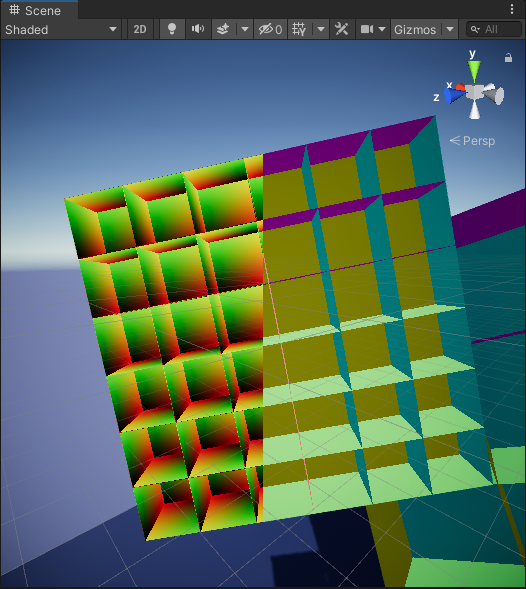
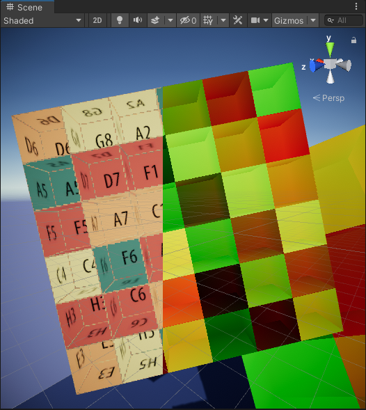
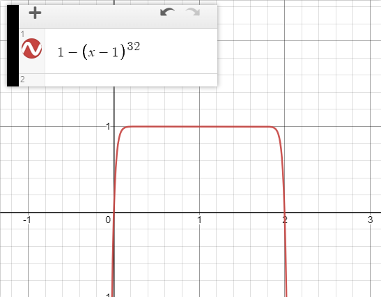

# //EP2// 伪室内Shader

## Source
[EP2](https://github.com/Alligrater/Shader-Practice/tree/main/Assets/EPS/EP2)
## Overall
实用性： 不赖
美观程度： 懒得做材质

## Thought Process

学习了Tracing-X，于是决定研究一下伪室内Shader。

## Idea
1. 根据眼前的顶点位置，决定back plane的位置及法线朝向
2. Tracing-Plane求出back plane的距离
3. 根据房间位置求出uv偏移
4. 根据uv偏移采样材质
5. Post-FX
6. Composite

## 1. Which Plane?

参考了这个[文档](https://www.proun-game.com/Oogst3D/CODING/InteriorMapping/InteriorMapping.pdf)

把相机位置和视野方向转换到物体空间下，然后根据物体空间的xyz坐标，决定back plane的偏移量。

如果视野方向x分量<0,则trace左边的平面。如果x分量>0,trace右边的平面。
y分量和z分量同理。




```
	float roomHeight = 1 / _RoomCountV;
	float roomWidth = 1 / _RoomCountH;

	float yDirection = sign(rayDirection.y);
	float offset = max(yDirection, 0.0); //no negative directions
	float yPlanePos = 1 - (floor(hitPos.y * _RoomCountV + offset) - yDirection) * roomHeight - 0.5;

	float xDirection = sign(rayDirection.x);
	offset = max(xDirection, 0.0);
	float xPlanePos = 1 - (floor(hitPos.x * _RoomCountH + offset) - xDirection) * roomWidth - 0.5;

	float zDirection = sign(rayDirection.z);
	offset = max(zDirection, 0.0);
	float zPlanePos = 1 - (floor(hitPos.z * _RoomCountH + offset) - zDirection) * roomWidth - 0.5;

```

最开始的版本用了各种各样的if，后来发现可以不用if完成这个步骤。

## 2. Tracing-Plane


贴一张Keenan的教案。简单地说，假设有一个平面Nx = c，以及射线o+td。
用o+td替代x，得N·o + t*N·d = c。稍微调换下顺序得t = (c - N·o) / (N·d)
解出来的t就是即为从o出发，向d方向前进，命中平面N时所需要的时间。

因为所有平面都在物体空间下，所以这些平面刚好都是轴对齐的，也就是说可以简化N·o和N·d为他们在x,y,z上的分量。

```
	float tx = ((xPlanePos) - rayOrigin.x) / rayDirection.x;
	float ty = ((yPlanePos) - rayOrigin.y) / rayDirection.y;
	float tz = ((zPlanePos) - rayOrigin.z) / rayDirection.z;

	return min(tx, min(ty, tz));

```
求出来的这三个平面的最小值，自然就是最先命中的平面了。
已经可以看出来一点房间的效果了。



## 3. UV & Normal

这里被迫用了if，因为一时半会想不到更好的办法。不过，既然用了if，就顺便把比较t的部分也挪到if里面吧。

```
	float min_t = tz;
	uv = -roomSpacePos.xy * fixed2(_RoomCountH, _RoomCountV);
	surfaceNormal = zNormal;
	if(tx < min_t){
		min_t = tx;
		surfaceNormal = xNormal;
		uv = -roomSpacePos.zy * fixed2(_RoomCountH, _RoomCountV);
	}
	if(ty < min_t){
		min_t = ty;
		surfaceNormal = yNormal;
		uv = roomSpacePos.xz * _RoomCountH;
	}
	uv = saturate(frac(uv - 0.5));

```
UV & Normal 长这样


## 4. 偏移采样
在第一个部分的内容后面，加了一个新的变量RoomCenter，用来记录房间中心的位置。

```
	//......
	float zDirection = sign(rayDirection.z);
	offset = max(zDirection, 0.0);
	float zPlanePos = 1 - (floor(hitPos.z * _RoomCountH + offset) - zDirection) * roomWidth - 0.5;
	//....

	roomCenter.x = xPlanePos - xDirection * roomWidth * 0.5;
	roomCenter.y = yPlanePos - yDirection * roomHeight * 0.5;
	roomCenter.z = zPlanePos - zDirection * roomWidth * 0.5;
	
```

有了房间位置就好办了，可以根据位置生成一个随机数，用来偏移uv。
```
	static const float3 random_vector = float3(1.334f, 2.241f, 3.919f);

	float random_from_pos(float3 pos){
		return frac(dot(pos, random_vector) * 383.8438);
	}
```

根据这个偏移量，以及图集的数量，即可求出每个uv应该采样图集的哪个部分。

```
	//根据房间中心生成随机数
	float roomProperty = random_from_pos(roomCenter);
	//根据图集大小决定每次偏移的量
	float roomTextureSize = _TexRow * _TexCol;
	float roomUV = floor(roomProperty * roomTextureSize); //extract the uv coordinates
	float xOffset = (roomUV % _TexRow);
	float yOffset = (roomUV - xOffset) / _TexRow;
	//求出当前房间的uv偏移量
	fixed2 uvOffset = fixed2(xOffset / _TexCol, yOffset / _TexCol);
	uv = uv / float2(_TexRow, _TexCol) + uvOffset;

```


小熊软糖(不是)

最后采样即可……噪点有一点多，感觉是tracing-x的弊端，因为没法向上采样。

## 5. Post-FX
一个偷懒的办法，利用之前求出的uv坐标，加入伪AO。
desmos上算出来这么一条曲线。


```
	//横向
	fixed ao = saturate(1 - pow(abs(uv.x * 2.0 - 1.0), _AOPower);
	//纵向
	ao *= saturate(1 - pow(abs(uv.y * 2.0 - 1.0), _AOPower));
	ao = 1 - ((1 - ao) * _AOIntensity);
	return ao;
```
## 6. Composite
把之前的内容全部合并起来……齐活。懒得搞材质，就随便用网上的一张uv图代替了。


还不赖。加上伪AO之后感觉更贴近实际的样子。顺便利用法线方向加了点光照。
——DeveloGrater
